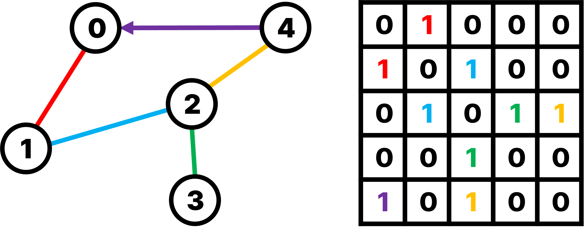
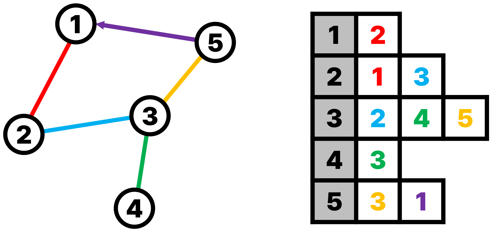
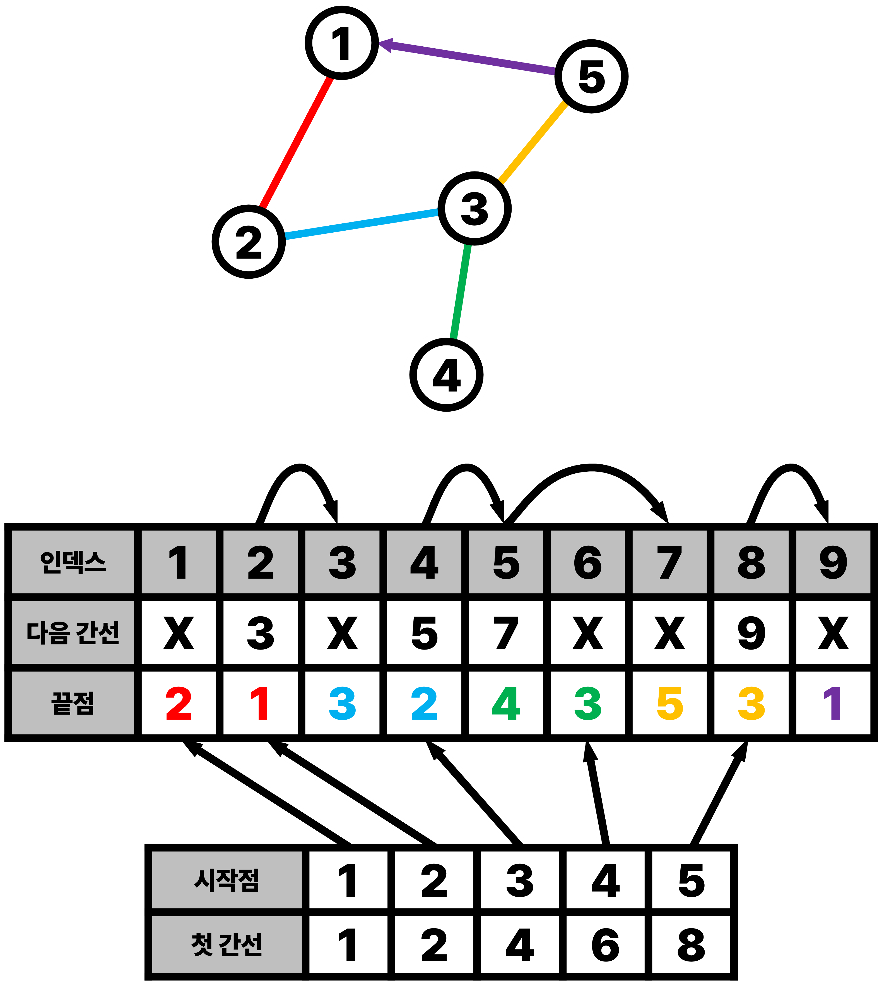

그래프 구조를 어떻게 나타낼 수 있는지 알아보겠습니다.

## 인접 행렬 (Adjacency Matrix)

그래프를 2차원 배열 형태로 표현하는 방법으로 인접 행렬이 있습니다.

인접 행렬 $a$에 대해서, $a[i][j]$의 값은 $i$와 $j$가 연결되어 있으면 1, 아니면 0을 가집니다.

방향성이 없는 경우 $a[i][j]$와 $a[j][i]$는 같습니다.

그래프에 따라서 가중치가 있는 경우 1 대신 가중치를 담을 수도 있고,
같은 끝점에 대해서 여러 개의 간선이 있는 경우 간선의 개수를 담을 수도 있습니다.

Rust에서는 `Vec<Vec<bool>>`를 통해 쉽게 구현할 수도 있고,
약간 복잡하지만 `Vec<bool>`를 이용해서 구현할 수도 있습니다.

두 정점 $i, j$를 연결하거나 두 정점의 연결을 끊는 연산의 경우 $a[i][j]$의 값을 설정하기만 하면 되므로
$O(1)$ 시간이 걸립니다.

두 정점 $i, j$가 서로 직접 연결되어 있는지 확인하는 연산의 경우도 $a[i][j]$의 값을 확인하기만 하면 되므로
$O(1)$ 시간이 걸립니다.

반면, 한 정점 $i$와 연결된 모든 정점을 순회하려면 $a[i][0]$부터 $a[i][V - 1]$까지의 값을 모두 확인해야 하므로
$O(V)$ 시간이 걸립니다.

또한 $a[0][0]$부터 $a[V - 1][V - 1]$까지의 값을 모두 저장해야 하므로 $O(V^2)$ 의 공간을 필요로 합니다.

## 인접 리스트 (Adjacency List)

일반적으로 문제에서 간선 추가, 그래프 순회가 자주 일어나는데,
인접 행렬의 그래프 순회는 최악의 경우 $O(V^2)$ 로 시간이 너무 오래 걸립니다.

또한 공간도 $O(V^2)$ 만큼 사용하기 때문에 큰 그래프를 저장하기 어렵습니다.

간선 삭제가 힘들어진 대신, 그래프 순회를 빠르게 만든 방식이 인접 리스트입니다.

인접 리스트 $L$은 리스트의 배열로, $L[i]$는 정점 $i$와 연결된 정점들의 리스트입니다.

Rust에서는 `Vec<Vec<usize>>`로 이를 표현할 수 있습니다.

> **잠깐, 왜 `usize`인가요?**
>
> Rust는 slice에 접근할 때 `usize`를 쓰도록 하고 있습니다.
>
> 정점 번호 $i$가 `usize`여야 $L[i]$에 접근 시 형변환을 할 필요가 없으므로
> 정점 번호의 타입은 `usize`로 하는 것이 편합니다.
>
> $L[i]$는 $i$와 연결된 정점들의 번호를 저장하고 있으므로, `Vec<usize>`를 사용하는 것이 자연스럽습니다.
>
> 따라서, $L$은 `Vec<Vec<usize>>`가 됩니다.

간선을 추가하는 것은 리스트에 정점을 하나 추가하면 되므로 $O(1)$ 시간이 걸리게 됩니다.

그래프를 순회하는 경우에, 한 정점과 연결된 정점을 탐색하려면 연결된 간선의 개수만큼 반복하게 되므로
전체 간선을 단 한 번씩만 방문할 수 있습니다.
따라서 순회는 $O(E)$ 시간이 걸립니다.

또한, 연결된 간선의 개수만큼만 정점 번호를 저장하므로 $O(E)$ 만큼의 공간을 필요로 합니다.

그래프에서 자주 쓰이는 연산에 대해 효율적인 시간 복잡도와 공간 복잡도를 가지기 때문에 주로 쓰이는 방법입니다.

## 인접 배열 (Adjacency Array)

마지막으로, 이 글을 쓰게 된 이유인 인접 배열에 대해서 설명드리려고 합니다.
(자료가 많지 않지만 Adjacency Array라고 가장 많이 불리는 것 같습니다.)

인접 리스트는 충분히 빠르지만, 각각의 리스트가 메모리 공간에 분리되어 위치하기 때문에
메모리 지역성이 충분히 달성되지 못합니다.

여기서 모든 간선을 한 배열에 몰아두는 방식을 떠올릴 수 있습니다.

$G$를 간선의 정보를 저장하는 배열이라고 하고, $F$에 각 정점과 연결된 첫 번째 간선의 인덱스를 저장합시다.

즉, $G[F[i]]$는 정점 $i$와 연결된 첫 번째 간선의 정보가 됩니다.

다음으로 간선의 정보를 정해 봅시다.

우리는 간선을 순회하고 싶기 때문에, 간선의 정보에는 다음 간선의 인덱스가 포함되어야 합니다.

그러면 다음 간선의 인덱스가 없을 때까지 $G$ 상에서 다음 간선 인덱스를 따라가는 것으로 그래프 순회를 할 수 있습니다.

Rust에서는 $F$: `Vec<Option<usize>>`, $G$: `Vec<(Option<usize>, usize)>`로 구현할 수 있습니다.

간선 추가, 그래프 순회에 대해 인접 리스트와 같은 시간복잡도를 가지지만
메모리 지역성으로 인해 더 높은 성능을 보여줍니다.

