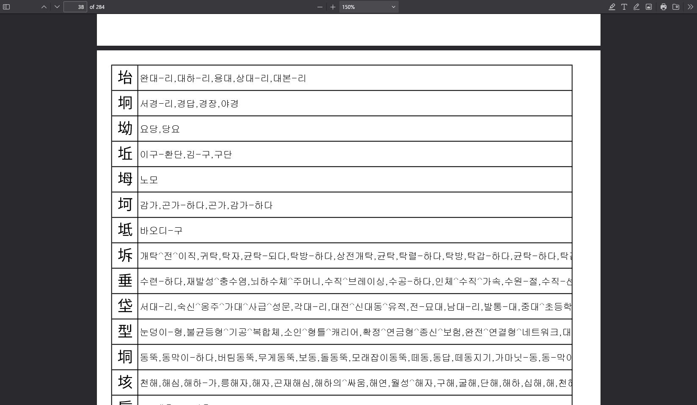

요즘 취미생활로 [우리말샘](https://opendict.korean.go.kr)에 실린 한자어와, 각 한자를 읽어보고 있습니다.

용례가 다양하지 않은 사용이 드문 한자의 경우에는 모든 단어의 뜻을 찾아보는데, 이중 "경답"이라는 단어가 눈에 띕니다.
한자 坰은 들판, 교외, 국경 근처 등을 의미하는 "경" 자로, 한국어문회에서는 "들 경"으로 특급Ⅱ에 배정했습니다.
이 坰 자가 쓰인 단어는 지명 "서경리"를 제외하고 아래와 같습니다.

- 경답(坰畓): 《표준국어대사전》 바닷가에 둑을 쌓고 만든 논. ≒갯논.
- 경장(坰場): 《표준국어대사전》 「1」 야외(野外)의 장소.「2」 활짝 트인 먼 곳.
- 야경(野坰): 《우리말샘》 「북한어」성문 밖의 들. (본래 북한어 및 방언 또한 《표준국어대사전》에 있었으나 현재는 모두 《우리말샘》에 있습니다.)

경장과 야경 모두 들판을 의미하는 유의자와 병치한 것으로 보이지만, 경답의 경우 단어가 직관적으로 연결되지는 않습니다.
坰 자가 둑 혹은 바닷가를 의미해야 할 것 같은데 "둑"은 고사하고 "바닷가"와 "교외"를 연결하는 것도 자연스럽지는 않습니다.

여기까지라면 연구나 제 지식의 부족일 수 있겠습니다만, 문제는 다음입니다.

굉장히 비슷한 垌 자와, 그리고 "동답"이라는 단어가 눈에 띕니다.

한자 垌은 항아리, 둑 등을 의미하는 "동" 자로, 한국어문회에서는 시험에 배정하지 않았습니다. (사실 여기서부터 KS X 1001에 포함되지 않았다는 점을 눈치챌 수 있습니다.)
그리고 垌 자가 쓰인 단어 "동답"이 있습니다.

- 동답(垌畓): 《표준국어대사전》 간석지에 둑을 쌓아 만든 논.

굉장히 비슷한 뜻이고, 각 글자의 뜻으로 굉장히 자연스러운 해석이 가능합니다.
坰과 垌은 굉장히 비슷한 글자이고, 쓰기에 따라 헷갈릴 수 있으며, 사실 동자 관계에 있을 수 있다고 생각했습니다.
실제로 《두시언해》 권24에서는 [교경(郊坰)을 교동(郊垌)으로 잘못 표기한 예](https://find.xn--gt1b.xyz/source?name=%EB%91%90%EC%8B%9C%EC%96%B8%ED%95%B424%20%EC%88%98%EC%A0%95&n=106&hl=%E5%9E%8C&is=no)가 있습니다.

그런데 한국학자료통합플랫폼에서 [垌畓을 검색하면 40건](https://kdp.aks.ac.kr/search/list?q=query%E2%80%A0%E5%9E%8C%E7%95%93), [오표기로 의심되는 坰畓은 23건](https://kdp.aks.ac.kr/search/list?q=query%E2%80%A0%E5%9D%B0%E7%95%93)으로 크게 차이나지는 않는 것으로 보입니다.
정말로 지식 부족이었을까요?

坰畓의 용례 중 사전·공구 9건은 모두 고전자료 14건에 포함되는 내용입니다. 따라서 고전자료 14건만 보면 됩니다.
고전자료 14건 중 한국학중앙연구원 제공 《관서계록》에는 坰畓로 표시되어 있으나 원문에는 垌畓으로 쓰여 있습니다.
국사편찬위원회 제공 《각사등록》에는 모두 垌畓로 표시되어 있습니다. 아마도 과거에 坰畓였던 것이 수정 후에도 검색에 노출된 것으로 추측됩니다.
규장각한국학연구원 제공 자료는 원문에 垌畓로 쓰여 있는 경우도 있으나(《정주보현경답타조성책》, 《교하신촌송촌명례궁경답내맥도집세성책》, 《교하군석곶신촌송촌소재명례궁경답맥도집세성책》) 원문에서도 坰畓로 쓰인 경우가 있습니다.
원문에서 坰을 쓴 경우에도 사실 垌의 오표기 혹은 이표기로 볼 수 있는 이유는 각각 다음과 같습니다.

- [《숙천보민경답세조성책》](https://kyudb.snu.ac.kr/book/view.do?book_cd=GK20783_00): 평안도 숙천군 보민동 소재 명례궁 장토 문서로, 보민동 + 답 혹은 보민 + 동답으로 보는 것이 알맞습니다. 보민동의 표기가 다르나《숙천보민동전답정세본안》이 존재합니다.
- [《가산군소재내수사구관노경답두락타곡사표급작인성명성책》](https://kyudb.snu.ac.kr/book/view.do?book_cd=GK22085_00): 표지에는 坰畓이 쓰여 있으나 속표지에는 垌畓으로 쓰여 있습니다.
- [《義州府尹解由》](https://kyudb.snu.ac.kr/book/view.do?book_cd=TM15414_00): 원문 이미지를 확인할 수 없으나 [3년 후 작성된 동명의 문서](https://kyudb.snu.ac.kr/book/view.do?book_cd=TM15415_00)에서는 垌畓으로 쓰여 있습니다.

이상의 이유로 坰畓라는 표기는 3건만이 유효하며, 이마저도 "경답"을 의식한 표기로는 보기 어렵다고 생각합니다.
그리고 그 원인은 아마도 [KS X 1001](https://en.wiktionary.org/wiki/Appendix:Korean_Hanja_by_KS_X_1001_hangyol_code)에 배정되지 않은 垌 자 대신 坰 자를 사용한 탓이겠습니다.

《표준국어대사전》에 여전히 개인적으로 출전을 알 수 없는 단어들이 있습니다만(백유와, 발만) 출전이 존재하면서 명백히 잘못된 경우는 처음이라 글을 쓰게 되었습니다.
한국학 자료의 전산화에 인코딩의 벽이 가로막지 않았으면 하는 바람입니다.
